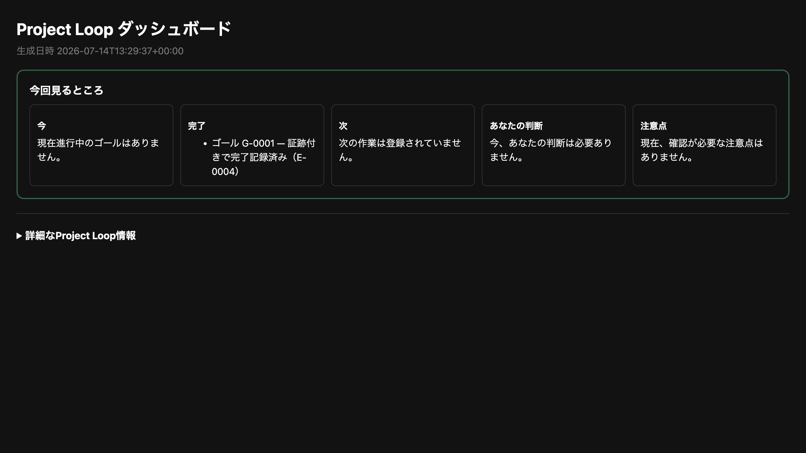

# Project Loop Harness

> Turn a coding agent's “done” into reviewable evidence, residual risk, and a
> resumable next step.



## Understand it in 30 seconds

Coding agents can produce changes quickly. They are less reliable at preserving
project state, proving completion, stopping at human decisions, and handing work
to another session or model.

Project Loop Harness (`pcl`) gives Codex, Claude Code, and similar agents one
local, model-neutral loop:

```text
intent → bounded work → checks → copied evidence → completion packet → next step
```

- SQLite keeps current state; JSONL keeps an auditable event projection.
- Tests, artifacts, reviews, and completion packets preserve what “done” means.
- Agents continue routine safe work; humans decide product, permission, security,
  destructive, and external-service questions.
- The runtime does not call an LLM or depend on one agent vendor.

It is for people coordinating coding agents, not another chat wrapper.

## Get first value in five minutes

Install the runtime with either tool:

```bash
pipx install project-loop-harness
# or: uv tool install project-loop-harness
```

Inspect the adoption plan before writing anything, then initialize:

```bash
cd /path/to/your-project
pcl init --dry-run --json
pcl init
pcl doctor --strict
```

`pcl init` detects common Python and Node project metadata and safe verification
commands. It retains existing `AGENTS.md`, `CLAUDE.md`, `.gitignore`, and
`pcl.yaml` content. `--force` may replace generated templates, but it does not
replace existing project-instruction content.

Now tell the coding agent the outcome—not a sequence of `pcl` commands:

```text
Read AGENTS.md, CLAUDE.md if present, and pcl.yaml. Use the Project Control
Loop. Start this goal: <describe the outcome>. Continue every agent-safe next
action, run the configured checks, preserve evidence, emit a completion packet,
and close the goal. Do not ask me to run routine pcl commands. Stop only for a
genuine human decision or external blocker.
```

The agent owns `pcl start → implementation → finish → close`. The operator uses
the CLI for setup, review, and deliberate maintenance.

Want to see the result before adopting it? Run the isolated
[3-minute public-package demo](examples/v0.5.0-adoption-demo/README.md).

## What the operator needs to remember

| Moment | Command | Purpose |
| --- | --- | --- |
| Adopt | `pcl init --dry-run --json`, then `pcl init` | Inspect and install local policy/state |
| Start | `pcl start "<outcome>"` | Preserve literal intent as Goal and Task |
| Orient | `pcl next --json` or `pcl resume` | Continue or hand off safely |
| Verify | `pcl finish --emit-packet --goal G-XXXX` | Rerun checks and pin evidence |
| Review | `pcl render` | Generate the human dashboard |

Most other commands are an agent-facing and maintainer-facing reference surface.
Start with the five moments above.

## What it is—and is not

```text
Skill          = instructions for agents
pcl CLI        = guarded local runtime and state machine
project.db     = current normalized loop memory
events.jsonl   = derived append-only audit projection
dashboard.html = generated human view, never machine state
Plugin / MCP   = optional integration wrappers, never the runtime
```

Project Loop Harness is local-only by default. Initialization enables no
telemetry, cloud sync, provider call, production access, or automatic GitHub
write. It is not a hosted orchestration service, a sandbox, or proof that an
agent understood the code.

Agents must not edit `.project-loop/project.db`, `.project-loop/events.jsonl`, or
generated dashboard HTML. State mutations go through `pcl`; machine context
comes from JSON commands, evidence paths, reports, or `dashboard-data.json`.

The protected and internal compatibility surfaces are documented in the
[Alpha Stability Policy](docs/stability-policy.md).

## Install and inspect in more detail

Use a project virtual environment instead of a global tool install when that is
the repository convention:

```bash
python -m pip install project-loop-harness
python -m pcl --version
```

For unreleased work, pin a tag or commit:

```bash
pipx install "git+https://github.com/mocchalera/project-loop-harness.git@<tag-or-commit>"
```

After initialization:

```bash
pcl validate --strict
pcl render --json
pcl update check       # explicit, cached, advisory only
```

Use `pcl update command` to print the appropriate manual upgrade command. Set
`PCL_NO_VERSION_CHECK=1` to disable version checks.

## The proof boundary

A release, download, clone, dashboard, or passing internal demo is output
evidence—not adoption evidence. v0.5.2 is being judged by observed first use in
real repositories: time to healthy setup, time to a verified completion packet,
maintainer interventions, safety violations, and voluntary reuse.

The frozen cohort method and success thresholds live in
[v0.5.2 Adoption Proof](docs/adoption-proof-v0.5.2.md). Until those observations
exist, the project does not claim external adoption.

## Documentation

- [Adoption Guide](docs/adoption-guide.md) — coexistence, distribution, and the
  first real repository.
- [3-minute demo](examples/v0.5.0-adoption-demo/README.md) — reproducible public
  package path to `COMPLETED_VERIFIED`.
- [Golden Path](docs/golden-path.md) — complete direct and workflow examples.
- [Architecture](docs/architecture.md) — state, events, evidence, and execution
  boundaries.
- [CLI Guide](docs/command-guide.md) — task-oriented command discovery.
- [Recovery Playbook](docs/recovery-playbook.md) — safe diagnosis and repair.
- [MCP compatibility](docs/mcp-compatibility.md) — optional client boundary.
- [Security](SECURITY.md) and [Contributing](CONTRIBUTING.md).

Advanced contracts stay in `docs/`: completion packets, evidence sets,
completion policy, context packs, code context, workflow execution, Council
Profile, trace/resume, reports, migrations, and dashboard data.

## Local development

```bash
python -m venv .venv
source .venv/bin/activate
python -m pip install -e '.[dev]'
ruff check .
pytest
PYTHONPATH=src python -m pcl --help
```

When working in a linked worktree, prefer `PYTHONPATH=src python -m pcl` or a
worktree-local virtual environment instead of repointing a shared executable.

Before release, verify both install artifacts:

```bash
python -m build --outdir /tmp/pcl-release-dist --sdist --wheel
python scripts/verify_sdist_contracts.py --dist-dir /tmp/pcl-release-dist
pytest tests/test_distribution.py
```

## Safety and current scope

The first production milestone deliberately excludes:

- hosted backends and cloud synchronization;
- production database access;
- autonomous destructive operations;
- automatic external notifications or repository writes;
- telemetry collection;
- dynamic workflows before static contracts are stable.

The current release is alpha software. Prefer pinned versions for team use,
inspect the dry-run plan, keep human gates human, and preserve evidence for every
terminal claim.
